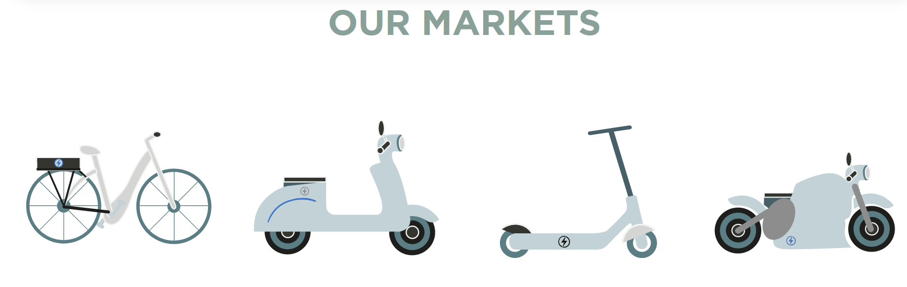

# Resources

### Websites for companies which offer the service
* [Akku-Mainz](https://akku-mainz.de/)
* [Rejoule Energy](https://rejouleenergy.com)
  * Start Up in California
  * Measures health of battery
  * Provides measuers on how to deal with the battery
* [RePurpose Energy](https://www.repurpose.energy/)
  * Transforms EV batteries into storage systems.
* [Volkswagen Qualification Centre, Erfurt](https://shaping-mobility.volkswagen.com/en/stories/battery-repairs-in-an-electric-car-is-that-possible-14762)
  * Location is Erfurt, Germany or Wolfsburg, Germany, new location to be opened in Nürtingen, Germany
  * Specific support centres accross Germany which accept electric cars for repairs
  * Accurate diagnosis required
  * Modules can be exchanged, cells cannot
  * If the battery still has 70 percent or more of its capacity remaining, it is definitely worth exchanging one or two modules
* [Nowos](https://nowos.com/)
  * Company with locations in the Netherlands and in France
  * 74% of batteries repaired
  * 
  * Specialized in lithium batteries

### Information
* [Opel Refurbishment Plant](https://vision-mobility.de/news/opel-eroeffnet-battery-refurbishment-center-in-ruesselsheim-82242.html)
* [Fortum Recycling Plant, Germany](https://www.fortum.com/media/2022/09/fortum-start-battery-recycling-operations-germany-serving-european-ev-automotive-industrys-rising-demand-battery-raw-materials)
* [Valmet Automotive invests in Battery Test Centre in Germany](https://www.valmet-automotive.com/media/news/valmet-automotive-invests-millions-in-new-battery-test-center-bad-friedrichshall)
* [Meet 10 companies poised to cash in on the alternative to battery recycling.](https://www.businessinsider.com/hot-companies-racing-reuse-refurbishment-electric-vehicle-batteries-2022-8)
  * 10 different companies which are prominent in battery recycling.